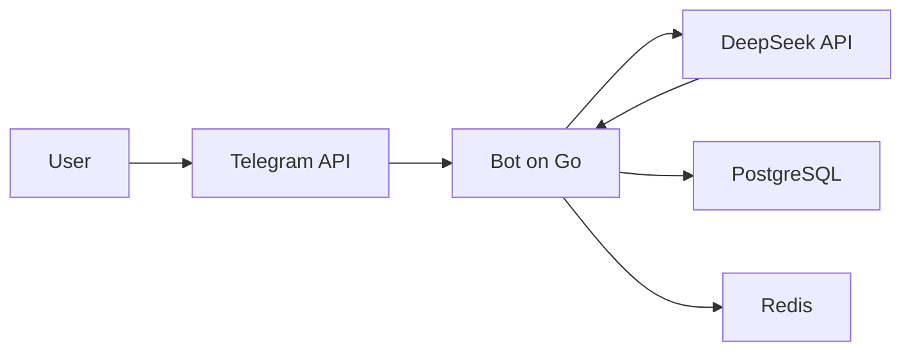

# Quokka-Bot Documentation
**[View Bot →](link)**
## Navigation
1. <a href="#user-documentation">User documentation</a>
2. <a href="#documentation-for-advanced-users-and-developers">Documentation for users and developers</a>
3. <a href="#privacy-policy">Privacy Policy</a>
4. <a href="#disclaimer--usage-policy">Disclaimer & Bot Usage Policy</a>
5. <a href="#license">License</a>
6. <a href="#support">Support</a>

### User documentation
This is the part of the user documentation that describes the bot's operation from the outside and provides recommendations for interacting with it

#### Commands for bot

| Command | Description
|-------------|---------------------------------------------------
| /start   | Welcome message and information about the bot
| /rules   | Bot usage policy, disclaimer
| /reset   | Clears all history of requests to DeepSeek
| /about   | Information about the bot
| /help    | Help
| /policy  | Privacy Policy
| Any text | Request to DeepSeek

In the current version of the bot v0.9.5, requests can only be textual, since the deepseek language model itself, to which requests are sent, is textual. This language model cannot process documents or any images, so the bot itself does not respond to such requests. The same applies to voice messages with circles.

#### Limits

This bot has some limitations. These limitations were introduced so that the bot can always respond to users and not overload the server.

1. **The maximum length of the bot's response is 4000 characters. If its response contains more characters, it will 'truncate' it to 4000 characters.**
2. **You cannot send requests to DeepSeek more often than every 1 minute.**
3. **From time to time, the bot may self-clean the deepseek request history.**

#### Possible questions:
1. **What is deepseek request history and why is it stored in the database?** - Deepseek request history should be stored in the database so that it can understand the context of the conversation and help you with problems most effectively.
#### Possible errors:
1. **"⚠️ An error occurred while processing your request. Please try again later."** - DeepSeek server may be overloaded and it may return this error, which the bot notifies the user about. If you encountered the error only once, and then after some time the bot responded to you with the same message, then the server was really overloaded. But if you encountered the error more than once, please notify me: **@wnderbin - Telegram**
2. **"🤷 Unable to generate a response. The servers may be overloaded. You can try asking the question differently."** - This may happen if DeepSeek returned an empty response. This may happen due to an overload of the DeepSeek server, or you asked the question incorrectly. In this case, try asking the question differently.
3. **"⚠️ Failed to send a response. Please try again."** - This error may occur if the bot itself was unable to send a message to the user. In this case, try asking the request differently or asking the same request again.

#### About the bot

This bot is based on DeepSeek API V3 0324.

### Documentation for advanced users and developers
This part of the documentation for users and developers, which describes the principle of the bot 'inside'

#### Technical stack
**Language:** Golang(1.24.2) \
**Library:** telebot (Telegram Bot API) \
**AI:** DeepSeek API (V3 0324) \
**Database:** Postgres (Storing query history) \
**Caching:** Redis (anti-flood)

#### Architecture



**How ​​it works:**
1. User sends a message
2. Telegram API passes it to the bot
3. Bot:
* Checks the limit (via Redis)
* Makes a request to Postgres (adding a message, to save it in the conversation history and context of the correspondence) + encrypts your message
* Decrypts all messages, sends them to DeepSeek API
4. DeepSeek returns a response → the bot formats it (cuts it to 4000 characters) and sends it to the user.

**Key functions:**

**handlers/telegram.go:**
```
func (h *TelegramHandler) HandleText(c telebot.Context) error {
// 1. Anti-flood check
// 2. Sending a request to DeepSeek
// 3. Receiving a request from DeepSeek
// 4. Sending a response
}
```

**handlers/neural.go:**
```
func (h *NeuralHandler) HandleMessage(ctx context.Context, userID int64, text string) (string, error) {
// 1. Saving the user's request + encryption
// 2. Receiving messages to understand the context of the dialogue + decryption
// 3. Generates and sends a request
// 4. Receives a response and saves it in the database data
}
```

**models/deepseek.go:**
```
func (c *DeepSeekClient) ChatCompletion(ctx context.Context, req DeepSeekRequest) (string, error) {
1. Encodes the request to JSON
2. Sends the request to DeepSeek
3. Gets the response from DeepSeek
4. Decodes the response
5. Returns the response
}
```

#### Setting up the environment
1. Create a config.yaml file in the config/ directory
2. Specify the settings:
```
telegram-token: "<Telegram-Bot token>"
deepseek-token: "<DeepSeek API token>"
base-url: "<DeepSeek URL (without chat/completions)>"
deepseek-model: "<DeepSeek model>"
aes: "<AES-encryption key>"
debug-mode: <true/false>
```
3. Install dependencies
```
go mod download
```
4. Set up database connections in main.go
```
db, err := sql.Open("postgres", "postgres://<user>:<password>@<host>:<port>/<dbname>?sslmode=disable") // database connection
if err != nil {
log.Fatal(err)
}
defer db.Close()
migrator.ApplyMigrations(db) // apply migrations to the database
redisClient := redis.NewClient(&redis.Options{
Addr: "<host>:<port>",
Password: "",
DB: 0,
})
```
5. Run the bot
```
make quokka-run
--- or ---
CONFIG_PATH=./config/config.yaml go run main.go
```

### Privacy Policy

Privacy Policy is required to be read. The user automatically agrees to it when using the bot. [More]()

### Disclaimer | Usage Policy

The Usage Policy and Disclaimer are required to be read. The user automatically agrees to this policy when using the bot. [More]()

### License
**The project is distributed under the GNU Affero General Public License v3.0. This is a strict copyleft license that protects rights and requires openness of derivative works.**

#### Allowed

| Features | Explanation
|-------------|---------------------------------------------------
| Use| Run the bot for any purpose (personal, commercial, educational).
| Modify| Modify the code to suit your needs (add features, fix bugs).
| Distribute | Share the original or modified code.
| Study | Analyze the bot's work, study its algorithms.

#### Prohibited

| Restriction | Explanation
|-------------|---------------------------------------------------
| Close the code| Any changes must remain under AGPLv3.
| Use in SaaS| If your service uses this bot, you must open the entire code.
| Remove the license| All copies must include the original license text.

#### Special conditions:

**Mandatory code opening:** If you modify the bot and run it on a server (even privately), you must provide the source code to users. \
**Compatibility:** All derivative works can only be distributed under AGPLv3.

### Support:
Problems/suggestions? Write:
* **Telegram:** @wnderbin