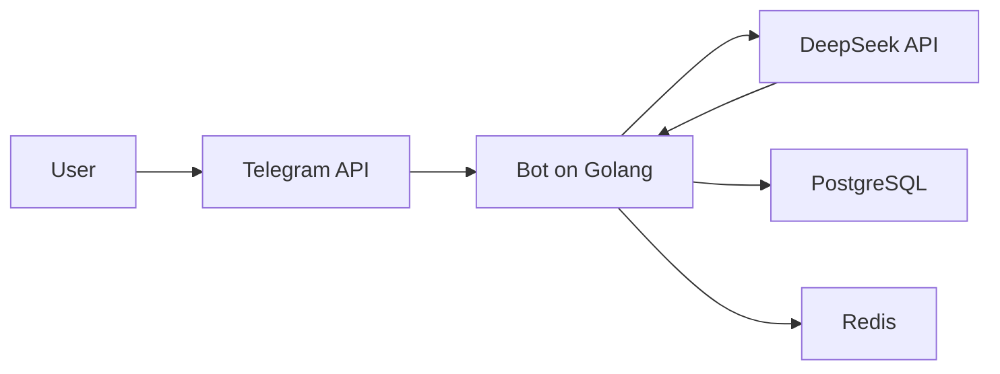

# Quokka-Bot Documentation
**[View the telegram-bot →](link)**
## Navigation
1. <a href="#user-documentation">User-documentation</a>
2. <a href="#documentation-for-advanced-users-and-developers">Documentation for users & developers</a>

### User documentation
This is the part of the documentation for users. It presents the principle of the bot's operation "from the outside" and recommendations on how to interact with it.

#### Commands for the bot

| Command     | Description 
|-------------|---------------------------------------------------
| /start      | Welcome message and information about the bot
| /reset      | Resets the history of the requests to the DeepSeek
| Any text    | Request for DeepSeek

Requests can only be textual, since the language model itself is textual. It cannot process documents or any images, so the bot does not respond to such requests. The same applies to voice and video messages.

#### Limits

This bot has some limits. These limits were introduced so that the bot can always respond to users and not overload the server.

1. **The maximum length of the bot's response is 4000 characters. If its response contains more characters, it will 'truncate' it to 4000 characters.**
2. **You cannot send messages to the bot more than 1 per minute**
3. **From time to time the bot can perform self-cleaning of the history of requests to the deepseek**

#### Possible questions:
1. **What is the history of deepseek queries and why is it stored in the database?** - The history of requests to the deepseek must be saved in the database so that he can understand the context of the conversation and help you with problems most effectively.
#### Possible errors:
1. **"⚠️ Произошла ошибка при обработке запроса. Пожалуйста, попробуйте позже."** - The DeepSeek server may be overloaded and it may return this error, which the bot notifies the user about. If you encountered the error only once, and then after some time the bot responded to you with the same message - then the server was really overloaded. But if you encountered the error more than once, please notify me: **@wnderbin - Telegram**
2. **"🤷 Не получилось сформировать ответ. Попробуйте задать вопрос иначе."** - This can happen if DeepSeek returned an empty response. This can happen because the DeepSeek server is overloaded, or you asked the question incorrectly. In this case, try asking the question differently.
3. **"⚠️ Не удалось отправить ответ. Пожалуйста, попробуйте еще раз."** - This error can happen if the bot itself was unable to send a message. In this case, try asking the query differently or asking the same query again.

#### About the bot
This bot is powered by DeepSeek API V3 0324

### Documentation for advanced users and developers
This is a part of the documentation for users and developers, which describes the principle of the bot's work 'inside'

#### Tech stack
**Language:** Golang(1.24.2) \
**Library:** telebot (Telegram Bot API) \
**AI:** DeepSeek API (V3 0324) \
**Database:** Postgres (Storing query history) \
**Caching:** Redis (anti-flood)

#### Architecture



**How ​​it works:** 
1. User sends a message
2. Telegram API passes it to the bot
3. Bot:
    * Checks the limit (via Redis)
    * Makes a query in Postgres (adding a message, to save it in the conversation history and context of the correspondence)
    * Sends the text to DeepSeek API
4. DeepSeek returns a response → the bot formats it (cuts it to 4000 characters) and sends it to the user.

**Key functions:**

**handlers/telegram.go:**
```
func (h *TelegramHandler) HandleText(c telebot.Context) error {
// 1. Anti-flood check
// 2. Sending a request to DeepSeek
// 3. Receiving a request from DeepSeek
// 4. Sending a response
}
```

**handlers/neural.go:**
```
func (h *NeuralHandler) HandleMessage(ctx context.Context, userID int64, text string) (string, error) {
// 1. Saving the user's request
// 2. Receiving messages to understand the context of the dialogue
// 3. Generates and sends a request
// 4. Receives a response and saves it in the database
}
```

**models/deepseek.go:**
```
func (c *DeepSeekClient) ChatCompeletion(ctx context.Context, req DeepSeekRequest) (string, error) {
1. Encodes the request to JSON
2. Sends the request to DeepSeek
3. Receives the response from DeepSeek
4. Decodes the response
5. Returns the response
}
```

#### Setting up the environment
1. Create a config.yaml file in the config/ directory
2. Specify the settings:
```
telegram-token: "<BOT-TOKEN>"
deepseek-token: "<DEEPSEEK-TOKEN>"
base-url: "<DEEPSEEK URL>" # (without "/chat/completions")
deepseek-model: "<DEEPSEEK MODEL>"
debug-mode: true/false
```
3. Install dependencies
```
go mod download
```
4. Set up database connections in the main.go file
```
db, err := sql.Open("postgres", "postgres://<user>:<password>@<host>:<port>/<dbname>?sslmode=disable") // database connection
if err != nil { 
log.Fatal(err) 
} 
defer db.Close() 
migrator.ApplyMigrations(db) // apply migrations to the database 
redisClient := redis.NewClient(&redis.Options{ 
Addr: "<host>:<port>", 
Password: "", 
DB: 0, 
})
```
5. Launch the bot
```
make quokka-run
--- or ---
CONFIG_PATH=./config/config.yaml go run main.go
```

### Privacy Policy

1. **The bot stores personal data of users for and distinction. Don't worry, the only thing that is related to personal data for storage is the Telegram ID, which the bot uses to distinguish users from each other. This is used to save the context of the dialogue with the neural network:**
```
CREATE TABLE chat_messages (
id SERIAL PRIMARY KEY,
user_id BIGINT NOT NULL,
role TEXT NOT NULL,
content TEXT NOT NULL,
created_at TIMESTAMP WITH TIME ZONE DEFAULT NOW()
);

CREATE INDEX idx_chat_messages_user_id ON chat_messages(user_id);
-- Using an index to quickly find records in a database
```
**The database only stores:**
1. **The user's Telegram ID.**
2. **The request that the user sent to the neural network.**
3. **The date the request was sent.**
4. **In addition to your requests, the database also stores the neural network's responses.***

**Such data in the database is automatically reset daily.**

### License
**The project is distributed under the GNU Affero General Public License v3.0. This is a strict copyleft license that protects rights and requires openness of derivative works.**

#### Allowed

| Features | Explanation
|-------------|---------------------------------------------------
| Use| Run the bot for any purpose (personal, commercial, educational).
| Modify| Change the code to suit your needs (add features, fix bugs).
| Distribute | Share the original or modified code.
| Study | Analyze the bot's work, study its algorithms.

#### Forbidden

| Limitation | Explanation
|-------------|---------------------------------------------------
| Close the code| Any changes must remain under AGPLv3.
| Use in SaaS| If your service uses this bot, you must open source the entire code.
| Remove license | All copies must include the original license text.

#### Special conditions:

**Mandatory open source:** If you modify the bot and run it on a server (even privately), you must provide the source code to users. \
**Compatibility:** All derivative works may only be distributed under AGPLv3.

### Support:
Problems/suggestions? Write:
* **Telegram:** @wnderbin