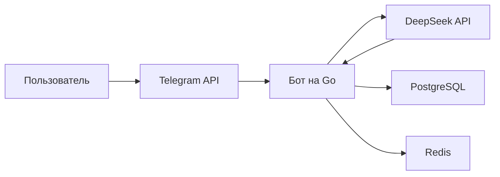

# Документация Quokka-Bot
**[Посмотреть бота →](https://t.me/quokka_spacebot)**
## Навигация
1. <a href="#документация-для-пользователя">Пользовательская документация</a>
2. <a href="#документация-для-опытных-пользователей-и-разработчиков">Документация для пользователей и разработчиков</a>
3. <a href="#политика-конфиденциальности">Политика конфиденциальности</a>
4. <a href="#дисклеймер--политика-использования">Отказ от ответственности & политика использования бота</a>
5. <a href="#лицензия">Лицензия</a>
6. <a href="#поддержка">Поддержка</a>

### Документация для пользователя
Это часть документации для пользователей, в которой изложен принцип работы бота «извне» и даны рекомендации по взаимодействию с ним

#### Команды для бота

| Команда     | Описание
|-------------|---------------------------------------------------
| /start      | Приветственное сообщение и информация о боте 
| /rules      | Политика спользования бота, снятие ответственности
| /reset      | Очищает всю историю запросов к DeepSeek
| /about      | Информация о боте
| /help       | Помощь
| /policy     | Политика Конфиденциальности
| Любой текст | Запрос к DeepSeek

В текущей версии бота v1.0 запросы могут быть только тектовыми, так как сама языковая модель deepseek, к которой отправляют запросы является текстовой. Данная языковая модель не может обрабатывать документы или какие-либо изображения, поэтому сам бот не отвечает на такие запросы. То же самое применимо и к голосовым сообщениям с кружочками.

#### Лимиты

У этого бота есть некоторые ограничения. Эти ограничения были введены для того, чтобы бот всегда мог отвечать пользователям и не перегружать сервер.

1. **Максимальная длина ответа бота - 4000 символов. Если его ответ содержит большее количество символов, то он его 'обрежет' до 4000 символов.**
2. **Вы не можете отправлять запросы к DeepSeek чаще, чем в 1 минуту.**
3. **Время от времени бот может производить самоочистку истории запросов к deepseek.**

#### Возможные вопросы:
1. **Что такое история запросов к deepseek и почему она хранится в базе данных?** - История запросов к deepseek должна сохраняться в базе данных, чтобы он мог понимать контекст разговора и помогать вам с проблемами наиболее эффективно.
#### Возможные ошибки:
1. **"⚠️ Произошла ошибка при обработке запроса. Пожалуйста, попробуйте позже."** - Сервер DeepSeek может быть перенагружен и он может вернуть эту ошибку, о который бот уведомляет пользователю. Если ошибка вам встретилась лишь единожды, а затем спустя какое-то время бот на то же самое сообщение вам ответил - значит сервер был действительно перенагружен. Но если ошибка вам встретилась не единожды, пожалуйста, уведомите меня: **@wnderbin - Telegram**
2. **"🤷 Не получилось сформировать ответ. Возможно, сервера перегружены. Можете попробовать задать вопрос иначе."** - Может произойти по причине, если DeepSeek вернул пустой ответ. Это может произойти из-за перенагрузки сервера DeepSeek, либо вы задали вопрос неккоректно. В таком случае попробуйте задать вопрос иначе.
3. **"⚠️ Не удалось отправить ответ. Пожалуйста, попробуйте еще раз."** - Эта ошибка может возникнуть, если сам бот не смог отправить сообщение пользователю. В этом случае попробуйте задать запрос иначе или задать тот же запрос еще раз.

#### О боте 
Этот бот работает на основе DeepSeek API V3 0324.

### Документация для опытных пользователей и разработчиков
Эта часть документации для пользователей и разработчиков, в котоый изложен принцип работы бота 'внутри'

#### Технический стек
**Язык:** Golang(1.24.2) \
**Библиотека:** telebot (Telegram Bot API) \
**AI:** DeepSeek API (V3 0324) \
**База данных:** Postgres (Хранение истории запросов) \
**Кеширование:** Redis (антифлуд)

#### Архитектура



**Как это работает:** 
1. Пользователь отправляет сообщение
2. Telegram API передает его боту
3. Бот:
    * Проверяет лимит (через Redis)
    * Выполняет запрос в Postgres (добавление сообщения, для его сохранения в истории разговора и контекста переписки) + шифрует ваше сообщение
    * Расшифровывает все сообщения, отправляет их DeepSeek API
4. DeepSeek возвращает ответ → бот форматирует его (обрезает до 4000 символов) и отправляет пользователю. 

**Ключевые функции:**

**handlers/massage_handlers.go:**
```
func (h *TelegramHandler) HandleText(c telebot.Context) error {
	// 1. Проверка антифлуда
    // 2. Отправка запроса в DeepSeek
    // 3. Получение запроса из DeepSeek
    // 4. Отправка ответа
}
```

**handlers/neural.go:**
```
func (h *NeuralHandler) HandleMessage(ctx context.Context, userID int64, text string) (string, error) { 
    // 1. Сохранение запроса пользователя + шифрование
    // 2. Получение сообщений для понимания контекста диалога + расшифровка
    // 3. Формирует и направляет запрос
    // 4. Получает ответ и сохраняет его в базе данных
}
```

**models/deepseek.go:**
```
func (c *DeepSeekClient) ChatCompeletion(ctx context.Context, req DeepSeekRequest) (string, error) {
	1. Кодирует запрос в JSON
    2. Отправляет запрос DeepSeek
    3. Получает ответ из DeepSeek
    4. Декодирует ответ
    5. Возвращает ответ
}
```

#### Настройка окружения
1. Создадите файли config.yaml в директории config/
2. Укажите настройки:
```
telegram-token: "<Telegram-Bot token>"
deepseek-token: "<DeepSeek API token>"
base-url: "<DeepSeek URL (without chat/completions)>"
deepseek-model: "<DeepSeek model>"
aes: "<AES-encryption key>" 
debug-mode: <true/false>
```
3. Установите зависимости
```
go mod download
```
4. Настройте подключение к базам данных в файле main.go
```
db, err := sql.Open("postgres", "postgres://<user>:<password>@<host>:<port>/<dbname>?sslmode=disable") // database connection
	if err != nil {
		log.Fatal(err)
	}
	defer db.Close()
	migrator.ApplyMigrations(db) // apply migrations to the database
	redisClient := redis.NewClient(&redis.Options{
		Addr:     "<host>:<port>",
		Password: "",
		DB:       0,
	})
```
5. Запустите бота
```
make quokka-run
--- or ---
CONFIG_PATH=./config/config.yaml go run main.go
```

### Политика конфиденциальности

Политика конфиденциальности обязательна к ознакомлению. Пользователь автоматически соглашается с ней, при использовании бота. [Подробнее](https://github.com/wnderbin/QuokkaAI-Bot/tree/main/privacy)

### Дисклеймер | Политика использования

Политика использования и дисклеймер обязательны к ознакомлению. Пользователь автоматически соглашается с этой политикой при использовании бота. [Подрбнее](https://github.com/wnderbin/QuokkaAI-Bot/tree/main/rules)

### Лицензия
**Проект распространяется под GNU Affero General Public License v3.0. Это строгая копилефт-лицензия, которая защищает права и требует открытости производных работ.**

#### Разрешено

| Возможности | Пояснение
|-------------|---------------------------------------------------
| Использовать| Запускать бота для любых целей (личных, коммерческих, образовательных).
| Модифицировать| Изменять код под свои нужды (добавлять фичи, исправлять баги).
| Распространять | Делиться оригинальным или изменённым кодом.
| Изучать | Анализировать работу бота, исследовать его алгоритмы.

#### Запрещено

| Ограничение | Пояснение
|-------------|---------------------------------------------------
| Закрывать код| Любые изменения должны оставаться под AGPLv3.
| Использовать в SaaS| Если ваш сервис использует этого бота — вы обязаны открыть весь код.
| Удалять лицензию| Все копии должны включать оригинальный текст лицензии.

#### Особые условия:

**Обязательное открытие кода:** Если вы модифицируете бота и запускаете его на сервере (даже приватно), вы должны предоставить исходный код пользователям. \
**Совместимость:** Все производные работы могут распространяться только под AGPLv3.

### Поддержка:
Проблемы/предложения? Пишите:
* **Telegram:** @wnderbin
